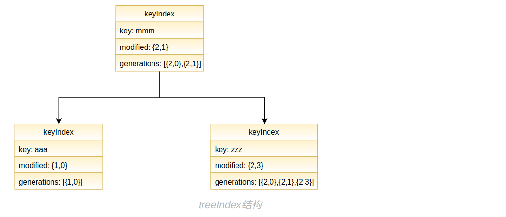
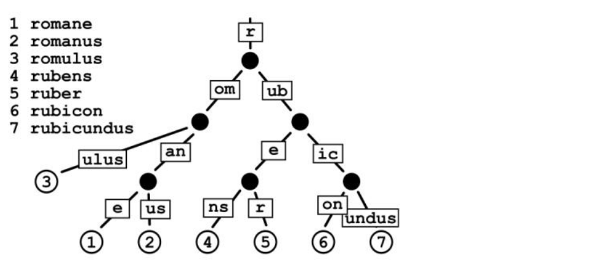
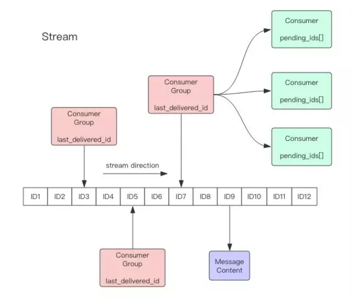

# 2019.12技术学习笔记

etcd，go-micro，redis stream学习笔记

## etcd

etcd通过复制来实现高可用，通过主从懒同步来实现线性一致性。

##### 数据结构



图中有错，修正一下：

```go
key: mmm
modified: {3,1}
generatioins:[{3,0},{3,1}]
```

版本号的含义{1, 0} 表示在第1个事务中的第0个操作。

分析一下键 zzz ：

```go
key: zzz
modified: {2,3}  //  表示key的最后修改在第 2 个事务的第 3 个操作
generations[{2,0},{2,1},{2,3}] //  表示key在2.0被创建，在2.1被修改过一次，在2.3被修改过一次
```

对 zzz 进行如下操作：

```go
//  假设事务id为4
etcdctl del zzz
```

zzz 会变成：

```go
key: zzz
modified: {}  //  表示key已经被删除
generations[[{2,0},{2,1},{2,3},{4,0}(t)]] //  表示key在2.0被创建，在2.1被修改过一次，在2.3被修改过一次,在{4,0}被删除
```

对 zzz 进行如下操作：

```go
//  假设事务id为5
etcdctl put zzz val1
```

zzz 会变成：

```go
key: zzz
modified: {5,0}  //  表示key的最后修改在第 5 个事务的第 0 个操作
generations[[{2,0},{2,1},{2,3},{4,0}(t)],[{5.0}]] //  表示key在2.0被创建，在2.1被修改过一次，在2.3被修改过一次,在{4,0}被删除，在5.0又被创建
```

那 zzz 的值 val1 存到哪里了呢？存到了 boltdb中，boltdb中的key为版本号{5,0}，value为 “zzz, val1”，boltdb还存储了{2,0}, {2,1}, {2,3},{4,0}的版本，用 compact 命令才会真正在存储中删去一些 key。

利用 key 的版本号和事务可以实现分布式锁：

```go
func GetLock(key string) bool {
    //  当 key 不存在时 CreateRevision == 0
    //  结合前面对版本号的分析，猜测 etcd 使用乐观锁实现事务的隔离性
    rsp, _ := cleint.
    			If(client.Compare(client.CreateRevision(key), "=", 0)).
    			Then(client.OpPut(key, "")).
				Commit()
    return rsp.Successed
}
```


##### 持久性

这是一颗存储在内存中的b树，那如果发生了故障我的数据不是gg了？原来etcd还会记录wal文件，一个只进行追加写的log文件。那为什么不直接在磁盘中维护b树呢？维护b树会导致大量磁盘随机读，性能肯定没wal文件好！


##### 集群数据一致性

etcd 通过 raft 算法选出一个 leader，然后 leader 作为主节点进行主从复制。

写请求一定会路由到主节点，主节点会进行两阶段提交，当超过一半的节点回答能提交就会发起提交请求。

读请求是可以路由到任意节点的，因为是半数确认就提交，那读请求路由到了落后的节点怎么办？原来从节点处理读取时还会跟主节点确认一次数据(先确认一下commitId是否一致，如果一致说明数据是新的，否则进行数据同步)，这样就保证了系统的线性一致性。

所以说 etcd 是懒同步的！这提高了写的可用性(如果写需要所有节点同意的话会大大降低可用性)，代价就是更昂贵的读。


**使用姿势**

在我之前设计的分布式crontab系统中有使用队列来解耦。因为不想引入太多组件(etcd 有用来做服务发现)，而且这个场景对队列的性能要求不高，所以直接用 etcd 模拟了一个。


## go-micro

go-micro是一个可插拔的微服务框架，我的demo插的组件是，grpcServer，grpcClient，roundRobin，etcd，其他的组件为默认。

先说一下主要的接口：

```go
Service     //  协调各组件
Server      //  服务注册，路由注册，处理请求
Client      //  服务发现，负载均衡，连接池，发送请求
Register    //  server就是向它注册，client就是从它那里发现server
Selector    //  client发现了那么多符合要求的server，怎么选择好呀
Codec       //  client发送数据的编码方式，会根据content-type new一个出来然后调用write
Broker      //  相对独立的pub/sub功能，封装起来应该是为了统一接口，实现可插拔
Transport   //  我选用 grpc 组件通信，没看到对 Transport 的使用，先不管它
```

server.go

```go
//  服务配置
srv := grpc.NewServer(
	server.Name("go.micro.server"),
	server.Version("myVersion"),
	server.Wait(nil),
	server.RegisterTTL(15*time.Second),
	server.RegisterInterval(5*time.Second),
	grpc.MaxMsgSize(2*1024*1024),
	)
```

grpc.go

```go
func NewServer(opts ...server.Option) server.Server {
	return newGRPCServer(opts...)
}

func newGRPCServer(opts ...server.Option) server.Server {
    // 先生成一个默认的配置结构体，然后调用我们传入的配置函数修改配置
	options := newOptions(opts...)
	// create a grpc server
	srv := &grpcServer{
		opts: options,
        // 这个只是借用已经实现的 rpc 来注册路由表，运行的不是这个 rpc 服务
		rpc: &rServer{
			serviceMap: make(map[string]*service),
		},
		handlers:    make(map[string]server.Handler),
		subscribers: make(map[*subscriber][]broker.Subscriber),
		exit:        make(chan chan error),
		wg:          wait(options.Context),
	}
    // 根据我们的options生成一个google/grpc库中的server保存到srv.srv中
    // 这个server是到时候我们真正运行的server
	// configure the grpc server
	srv.configure()

	return srv
}
func (g *grpcServer) configure(opts ...server.Option) {
    //  构造 google/grpc server需要的参数
	maxMsgSize := g.getMaxMsgSize()
	gopts := []grpc.ServerOption{
        //  我们的配置 MaxMsgSize = 2*1024*1024
		grpc.MaxRecvMsgSize(maxMsgSize),
		grpc.MaxSendMsgSize(maxMsgSize),
        //  后面会看到所有的请求都会路由到g.handler，因为没给 goolge/grpc server注册其他路由
		grpc.UnknownServiceHandler(g.handler),
	}
	//  获取 context 里面关于 grpc 验证的配置
	if creds := g.getCredentials(); creds != nil {
		gopts = append(gopts, grpc.Creds(creds))
	}
	//  获取 context 里面关于 grpc 的一半配置
	if opts := g.getGrpcOptions(); opts != nil {
		gopts = append(gopts, opts...)
	}
	//  new 一个 google/grpc 的 server
	g.srv = grpc.NewServer(gopts...)
}
```

一个options结构体为：

```go
type Options struct {
	Codecs       map[string]codec.NewCodec  //  编码方式
	Broker       broker.Broker				//  相对独立的pub/sub功能
	Registry     registry.Registry			//  etcd的lease和keepalive实现服务注册和保活
	Transport    transport.Transport		//  grpc 没看到有用这个，先不管
	Metadata     map[string]string			//  注册时可以带上元数据
	Name         string						//  服务的名字，默认 go.micro.serve
    Address      string						//  服务监听地址，默认 :0，0表示自动分配端口
	Advertise    string						//  也是地址，设置了的话注册时就注册这个，还不知道有什么用
	Id           string						//  uuid自动生成
	Version      string						//  服务版本
	HdlrWrappers []HandlerWrapper			//  感觉是类似于中间件的东西
	SubWrappers  []SubscriberWrapper		//  感觉是类似于中间件的东西
	RegisterCheck func(context.Context) error  //  注册之前会运行这个函数
	RegisterTTL time.Duration               //  注册自己之后 lease 的过期时间
	RegisterInterval time.Duration			//  保活时间间隔，防止键过期
	Router Router							//  如果设置了，就用这个路由器处理
	Context context.Context					//  waitgroup 和 一些特定组件的参数就往这塞，比如 grpc 的 MaxMsgSize
}
```

我们传进来的配置函数基本就是直接修改这个结构体，有些还没搞懂是干嘛的，暂不理会。

比较不同的是 grpc.MaxMsgSize(2\*1024\*1024) 它是将值存储在 context 中的，不是所有server组件都有的参数就放到context中。

```go
func MaxMsgSize(s int) server.Option {
	return func(o *server.Options) {
		if o.Context == nil {
			o.Context = context.Background()
		}
        //  放到 context 中
		o.Context = context.WithValue(o.Context, maxMsgSizeKey{}, s)
	}
}
```

grpc 其实有很多配置，go-micro 提供了3个需要特殊处理的 Codec，AuthTLS，MaxMsgSize，其他的可以通过 grpc.Options 函数直接修改：

```go
func Options(opts ...grpc.ServerOption) server.Option {
	return func(o *server.Options) {
		if o.Context == nil {
			o.Context = context.Background()
		}
		o.Context = context.WithValue(o.Context, grpcOptions{}, opts)
	}
}
```

server.go

```go
reg := etcd.NewRegistry(
	registry.Addrs("127.0.0.1:2379"),
	registry.Timeout(10*time.Second),
	)
```

道理是一样的，registry.Timeout表示请求超时时间。

```go
func NewRegistry(opts ...registry.Option) registry.Registry {
	e := &etcdRegistry{
		options:  registry.Options{},
		register: make(map[string]uint64),
		leases:   make(map[string]clientv3.LeaseID),
	}
    //  这个函数没啥，就是配置一下tls，集群地址
	configure(e, opts...)
	return e
}
//  registry 的 options 字段比较少
type Options struct {
	Addrs     []string		 //  etcd的地址
	Timeout   time.Duration  //  请求超时
	Secure    bool
	TLSConfig *tls.Config    //  tls配置
	// Other options for implementations of the interface
	// can be stored in a context
	Context context.Context
}
```

把我们的组件插到框架上。

server.go

```go
service := micro.NewService(
    	//  调用micro.Registry生成的函数的时候会修改当前Server，Client的配置，要注意它们的顺序，否则就改不到了哦。
		micro.Server(srv),
		micro.Registry(reg),
	)
```

```go
func Registry(r registry.Registry) Option {
	return func(o *Options) {
		o.Registry = r
        // 会更新跟registry相关的配置
		// Update Client and Server
		o.Client.Init(client.Registry(r))
		o.Server.Init(server.Registry(r))
		...
	}
}
```

接下来就是注册路由了。

server.go

```go
//  这个是go-micro框架生成的注册函数
err := proto.RegisterGreeterHandler(service.Server(), &Greeter{})
if err != nil {
	fmt.Println(err.Error())
	return
}
```

稍微跟一下go-micro生成的协议文件就能来到下面两个注册路由的方法。

```go
func (g *grpcServer) NewHandler(h interface{}, opts ...server.HandlerOption)
	//  利用反射获取h的类名和方法名
	return newRpcHandler(h, opts...)
}

func newRpcHandler(handler interface{}, opts ...server.HandlerOption) server.Handler {
    ...
	typ := reflect.TypeOf(handler)
	hdlr := reflect.ValueOf(handler)
	name := reflect.Indirect(hdlr).Type().Name()
	for m := 0; m < typ.NumMethod(); m++ {
		if e := extractEndpoint(typ.Method(m)); e != nil {
            //  获取类的方法名
			e.Name = name + "." + e.Name
            ...
			endpoints = append(endpoints, e)
		}
	}
	//  感觉这部分比较繁琐，打个断点就一目了然了！
	return &rpcHandler{
		name:      name,    //  Greeter
		handler:   handler,	//  Greeter实例
		endpoints: endpoints,  //  Greeter.Hello
		opts:      options,	   //  空，我们没传任何option进来
	}
}

func (g *grpcServer) Handle(h server.Handler) error {
    //  h是我们上个函数返回的值
    //  注册到自己的路由表，这里没有注册到 google/grpc 的 server 上，而是自己维护了路由表
    //  h.Handler()返回Greeter实例
	if err := g.rpc.register(h.Handler()); err != nil {
		return err
	}
	//  Greeter => GreeterHandler
	g.handlers[h.Name()] = h
	return nil
}

func (server *rServer) register(rcvr interface{}) error {
	s := new(service)
    //  又做了一次反射
	s.typ = reflect.TypeOf(rcvr)
	s.rcvr = reflect.ValueOf(rcvr)
	sname := reflect.Indirect(s.rcvr).Type().Name()
	...  //  检查name是否为空，服务是否已注册过
	s.name = sname
	s.method = make(map[string]*methodType)

	// Install the methods
	for m := 0; m < s.typ.NumMethod(); m++ {
        //  获取类的方法，这个不是方法名，是可以调用的函数了
		method := s.typ.Method(m)
		if mt := prepareEndpoint(method); mt != nil {
			s.method[method.Name] = mt
		}
	}
	...
    //  Greeter => GreeterService
	server.serviceMap[s.name] = s
	return nil
}
```

不往真正的 server 上注册路由，那到时候怎么处理请求呢？

原来初始化 goolge/grpc 的 server 的时候配置了 grpc.UnknownServiceHandler(g.handler)，

所有请求都会路由到这个UnknownHandler，这个handler再处理路由，这就实现了自己的路由器，相当与只把 goolge/grpc 当做一个传输层。

```go
func (g *grpcServer) handler(srv interface{}, stream grpc.ServerStream) error {
    //  获取请求的类名，方法名
	fullMethod, ok := grpc.MethodFromServerStream(stream)
    //  Greeter, Hello
	serviceName, methodName, err := mgrpc.ServiceMethod(fullMethod)
	//  请求带过来的元数据
	gmd, ok := metadata.FromIncomingContext(stream.Context())
	//  gmd map[string][]string vs md map[string]string 复制过来处理可能更顺手
	md := meta.Metadata{}
	for k, v := range gmd {
		md[k] = strings.Join(v, ", ")
	}

	// 用来设置context到期
	to := md["timeout"]

    // 客户端的 x-content-type
    // 这个x-content-type拿出来不知道干嘛用的，后面也没看出来有啥用!
	ct := defaultContentType
	if ctype, ok := md["x-content-type"]; ok {
		ct = ctype
	}
	//  删除这两字段，不传给即将调用的 Hello 函数的 context
	delete(md, "x-content-type")
	delete(md, "timeout")

	//  开始构造 context
	ctx := meta.NewContext(stream.Context(), md)

	//  客户端地址
	if p, ok := peer.FromContext(stream.Context()); ok {
		md["Remote"] = p.Addr.String()
		ctx = peer.NewContext(ctx, p)
	}

	// context 到期时间
	if len(to) > 0 {
		if n, err := strconv.ParseUint(to, 10, 64); err == nil {
			var cancel context.CancelFunc
			ctx, cancel = context.WithTimeout(ctx, time.Duration(n))
			defer cancel()
		}
	}
	
    // 这部分跳过，配置了自己的 Router 就走这个分支
	// process via router
	if g.opts.Router != nil {
		...
	}
	
    // 获取 ServiceHandler ，就是我们刚才反射的那个，可以调用函数的那个 
	// process the standard request flow
	g.rpc.mu.Lock()
	service := g.rpc.serviceMap[serviceName]
	g.rpc.mu.Unlock()
	// 没有注册这个service
	if service == nil {
		return status.New(codes.Unimplemented, fmt.Sprintf("unknown service %s", serviceName)).Err()
	}
	// 获取我们即将调用的函数
	mtype := service.method[methodName]
    // 这个service没有这个方法
	if mtype == nil {
		return status.New(codes.Unimplemented, fmt.Sprintf("unknown service %s.%s", serviceName, methodName)).Err()
	}
	// 最常用的
    // 非流式方法
	// process unary
	if !mtype.stream {
		return g.processRequest(stream, service, mtype, ct, ctx)
	}
	// 流式方法
	// process stream
	return g.processStream(stream, service, mtype, ct, ctx)
}
```

只看处理非流式方法，处理流式的比较简单：

```go
func (g *grpcServer) processRequest(stream grpc.ServerStream, service *service, mtype *methodType, ct string, ctx context.Context) error {
	for {
		var argv, replyv reflect.Value
        // 利用反射获取即将调用的函数需要什么参数，并且 new 一个出来，对反射不是很熟(╯——╰)
		argIsValue := false
		if mtype.ArgType.Kind() == reflect.Ptr {
			argv = reflect.New(mtype.ArgType.Elem())
		} else {
			argv = reflect.New(mtype.ArgType)
			argIsValue = true
		}

		// 这里会根据客户端的content-type解码获得request
		if err := stream.RecvMsg(argv.Interface()); err != nil {
			return err
		}
		...
		// 构造返回值
		replyv = reflect.New(mtype.ReplyType.Elem())
		// 这个就是可以调用的函数了
		function := mtype.method.Func
		var returnValues []reflect.Value
		// 获取解码器
        //defaultGRPCCodecs = map[string]encoding.Codec{
		//"application/json":         jsonCodec{},
		//"application/proto":        protoCodec{},
		//"application/protobuf":     protoCodec{},
		//"application/octet-stream": protoCodec{},
		//"application/grpc":         protoCodec{},
		//"application/grpc+json":    jsonCodec{},
		//"application/grpc+proto":   protoCodec{},
		//"application/grpc+bytes":   bytesCodec{},
		//}
		cc, err := g.newGRPCCodec(ct)
        // 将刚才解码出来的结构又编码成字节数组
        // 是不是吃饱没事干，有待进一步学习O(∩_∩)O~~
		b, err := cc.Marshal(argv.Interface())

		// 这个 rpcRequest 虽然传进了函数里但是函数没有使用
		r := &rpcRequest{
			service:     g.opts.Name,
			contentType: ct,
			method:      fmt.Sprintf("%s.%s", service.name, mtype.method.Name),
			body:        b,
			payload:     argv.Interface(),
		}

		// 将即将调用的函数包一层 recovery
		fn := func(ctx context.Context, req server.Request, rsp interface{}) (err error) {	  
			defer func() {
				if r := recover(); r != nil {
					...  //  log
				}
			}()
            // 这个函数没有使用传进来的 req 参数...
            // rcvr为Greeter实例指针，argv 为上面解码出来的 request
			returnValues = function.Call([]reflect.Value{service.rcvr, mtype.prepareContext(ctx), reflect.ValueOf(argv.Interface()), reflect.ValueOf(rsp)})
			// 返回值肯定是错误，类型推断成 error 类型
			if rerr := returnValues[0].Interface(); rerr != nil {
				err = rerr.(error)
			}
			return err
		}

		// 这个先不管
		for i := len(g.opts.HdlrWrappers); i > 0; i-- {
			fn = g.opts.HdlrWrappers[i-1](fn)
		}

		statusCode := codes.OK
		statusDesc := ""

		// 正式执行我们的函数！再说一遍，这个 r 虽然传进去了，但是函数并没有使用！
		if appErr := fn(ctx, r, replyv.Interface()); appErr != nil {
			...  //  处理状态码
		}
        // 返回响应
		if err := stream.SendMsg(replyv.Interface()); err != nil {
			return err
		}
		return status.New(statusCode, statusDesc).Err()
	}
}
```


看完了怎么处理请求的，接下来我们的server要运行啦。

server.go

```go
err = service.Run()
if err != nil {
	fmt.Println(err.Error())
	return
}
```

```go
func (s *service) Run() error {
	...  //  处理一些杂项
    
    //  调用server的Start方法，还会调用一些回调，我们没有设置
	if err := s.Start(); err != nil {
		return err
	}
	...
    //  监听信号或到期，优雅关闭
	select {
	case <-ch:
	case <-s.opts.Context.Done():
	}
    //  主要调用server的Stop方法，还会调用一些回调，我们没有设置
	return s.Stop()
}

func (g *grpcServer) Start() error {
	// 监听端口，我们没指定端口，系统会帮我们选择可用的端口
	ts, err := net.Listen("tcp", config.Address)
	// 获取系统选择的端口
	g.opts.Address = ts.Addr().String()
	// 相对独立的pub/sub功能，不管
	if err := config.Broker.Connect(); err != nil {
		return err
	}
	// 往etcd注册自己的信息了，包括地址，服务名，元数据等
    // 累了，不想展开了
	if err := g.Register(); err != nil {
		log.Log("Server register error: ", err)
	}

	// g.srv.Serve 就是经典的 for-accept-go 循环
	go func() {
		if err := g.srv.Serve(ts); err != nil {
			log.Log("gRPC Server start error: ", err)
		}
	}()
	// etcd的保活，如果不保活，上面注册的信息就会到期删掉
	go func() {
		t := new(time.Ticker)
		if g.opts.RegisterInterval > time.Duration(0) {
			t = time.NewTicker(g.opts.RegisterInterval)
		}
		var ch chan error
	Loop:
		for {
			select {
			// 保活
			case <-t.C:
				if err := g.Register(); err != nil {
					log.Log("Server register error: ", err)
				}
			// 收到退出信号
			case ch = <-g.exit:
				break Loop
			}
		}
		// 删除自己在etcd上的注册信息
		if err := g.Deregister(); err != nil {
			log.Log("Server deregister error: ", err)
		}
		// wait for waitgroup
		if g.wg != nil {
			g.wg.Wait()
		}
		//  如果server的context里有waitGroup就会调用Wait等待server处理完请求，我们是配置了的
		g.srv.GracefulStop()
	}()
	return nil
}

func (g *grpcServer) Stop() error {
   	//  对应保活协程的g.exit
	ch := make(chan error)
	g.exit <- ch
    ...
	return err
}
```

如果不保活键会在15s后过期(我们的配置是这样的)，每隔5s保活一次是因为之前的组长跟我说3次是真理！


client.go

```go
	//  服务配置
	sel := selector.NewSelector(selector.SetStrategy(selector.RoundRobin))
	cli := grpc.NewClient(
		client.Selector(sel),
		client.ContentType("application/json"),  //  改为json编码方式
		client.PoolSize(200),
		client.PoolTTL(2*time.Minute),
		client.RequestTimeout(10*time.Second),
		client.Retries(3),
		grpc.MaxSendMsgSize(2*1024*1024),
		grpc.MaxRecvMsgSize(2*1024*1024),
		)
	reg := etcd.NewRegistry(registry.Timeout(5*time.Second))
	service := micro.NewService(
		micro.Client(cli),
		micro.Registry(reg),
	)
	// greeter1
	greeter := proto.NewGreeterService("go.micro.server", service.Client())
	rsp, _ := greeter.Hello(context.TODO(), &proto.HelloRequest{Name: "John"})
	fmt.Println(rsp.Greeting)
	//  greeter2
	req := cli.NewRequest("go.micro.server", "Greeter.Hello", 		                              &proto.HelloRequest{Name: "Jack"})
	rsp1 := new(proto.HelloResponse)
	_ = cli.Call(context.TODO(), req, rsp1)
	fmt.Println(rsp1.Greeting)
```

服务配置的就不废话了，client初始化时就会建立连接池。

只要稍微分析一下go-micro生成的协议文件就会发现 greeter1 和 greeter2 的调用方式是等价的。

```go
func (g *grpcClient) NewRequest(service, method string, req interface{}, reqOpts ...client.RequestOption) client.Request {
	return newGRPCRequest(service, method, req, g.opts.ContentType, reqOpts...)
}
func newGRPCRequest(service, method string, request interface{}, contentType string, reqOpts ...client.RequestOption) client.Request {
	var opts client.RequestOptions
	for _, o := range reqOpts {
		o(&opts)
	}
	// 我们设置了 json 编码， 默认是 protobuf
	if len(opts.ContentType) > 0 {
		contentType = opts.ContentType
	}
	return &grpcRequest{
		service:     service,      //  go.micro.server
		method:      method,       //  Greeter.Hello
		request:     request,      //  &proto.HelloRequest{Name: "Jack"}
		contentType: contentType,  //  application/json
		opts:        opts,  	   //  空
	}
}
```

生成的req代表我们需要 go.micro.server 服务(这个就是server配置的Name)，需要请求这个服务上的 Greeter.Hello 路由(还记得ServiceHandler吗)。

HelloRequest，HelloResponse为协议文件的类。

只截取了部分cli.Call()的代码

```go
{......
call := func(i int) error {
		......
    	// 到registry选择出一个server
    	// 我们配置的selector是roundRobin
    	next, err := g.next(req, callOpts)
    	......
		node, err := next()
		service := req.Service()
		......
    	// 选择好了server后就要进行真正的请求了！
    	// gcall做的事情就是到连接池获取连接然后调用goolge/grpc的Invoke方法
    	// node是选出的服务端，req, rsp是我们传进去的参数
		err = gcall(ctx, node, req, rsp, callOpts)
    	// 给缓存做一些标志，比如这个server连不了之类的，没有细看
		g.opts.Selector.Mark(service, node, err)
		return err
	}
......
//  重试机制
for i := 0; i <= callOpts.Retries; i++ {
		go func(i int) {
            //  调用之前定义的call
			ch <- call(i)
		}(i)

		select {
		case <-ctx.Done():
			return errors.New("go.micro.client", fmt.Sprintf("%v", ctx.Err()), 408)
		case err := <-ch:
            //  成功直接返回
			if err == nil {
				return nil
			}
            //  判断是否达到了最大retry次数
			retry, rerr := callOpts.Retry(ctx, req, i, err)
			if rerr != nil {
				return rerr
			}
			if !retry {
				return err
			}
			gerr = err
		}
	}
	return gerr
}
```

selector是怎么选择node的呢？

```go
//  1.selector从自己的cache获取
//  2.cache根据service从列表或从etcd上获取地址列表，我们的service为go.micro.serve
//  3.selector从地址列表选择一个node

func (c *registrySelector) Select(service string, opts ...SelectOption) (Next, error) {
	//  从cache获取
	services, err := c.rc.GetService(service)
	//  过滤一些不符合要求的
	for _, filter := range sopts.Filters {
		services = filter(services)
	}
	//  选出一个node
	return sopts.Strategy(services), nil
}

//  GetService 调这个函数
func (c *cache) get(service string) ([]*registry.Service, error) {
	// 先检查 cache
	services := c.cache[service]
	// 获取缓存过期时间
	ttl := c.ttls[service]
	// cp用来返回的，防止自己与selector并发读写
	cp := registry.Copy(services)
	// 看cache返回了什么，比较过期时间
	if c.isValid(cp, ttl) {
		return cp, nil
	}

	// 如果缓存没有那就要走etcd了
	get := func(service string, cached []*registry.Service) ([]*registry.Service, error) {
		// 带上我们需要的service发起请求
		services, err := c.Registry.GetService(service)
		......
		// 缓存结果
		c.set(service, registry.Copy(services))
		return services, nil
	}
	.....
	// 正式发起请求
	return get(service, cp)
}

//  Strategy 调这个函数
func RoundRobin(services []*registry.Service) Next {
	......
	var i = rand.Int()
	var mtx sync.Mutex
    //  roundRobin 只针对一次 Call 调用（而且是在需要重试的情况下！）
    //  不同的 Call 之间是独立的！
	return func() (*registry.Node, error) {
		mtx.Lock()
		node := nodes[i%len(nodes)]
		i++
		mtx.Unlock()
		return node, nil
	}
}
```

继续看，gcall就是g.call：

```go
//  gcall
func (g *grpcClient) call(ctx context.Context, node *registry.Node, req client.Request, rsp interface{}, opts client.CallOptions) error {
	address := node.Address
	header := make(map[string]string)
    //  获取元数据放到header
	if md, ok := metadata.FromContext(ctx); ok {
		for k, v := range md {
			header[k] = v
		}
	}
	// 设置超时，这个超时是用来同步服务端的
	header["timeout"] = fmt.Sprintf("%d", opts.RequestTimeout)
	// json编码
	header["x-content-type"] = req.ContentType()
	// header放到context里一起传传给服务端
	md := gmetadata.New(header)
	ctx = gmetadata.NewOutgoingContext(ctx, md)
    
	// 获取json编码器
	cf, err := g.newGRPCCodec(req.ContentType())
	if err != nil {
		return errors.InternalServerError("go.micro.client", err.Error())
	}
	// 2*1024*1024
	maxRecvMsgSize := g.maxRecvMsgSizeValue()
	maxSendMsgSize := g.maxSendMsgSizeValue()

	var grr error
	//  获取合并 Dial 连接的配置
	grpcDialOptions := []grpc.DialOption{
		grpc.WithDefaultCallOptions(grpc.ForceCodec(cf)),
		grpc.WithTimeout(opts.DialTimeout), //  连接超时
		g.secure(),
		grpc.WithDefaultCallOptions(
			grpc.MaxCallRecvMsgSize(maxRecvMsgSize), //  最大接收字节数
			grpc.MaxCallSendMsgSize(maxSendMsgSize), //  最大发送字节数
		),
	}
	if opts := g.getGrpcDialOptions(); opts != nil {
		grpcDialOptions = append(grpcDialOptions, opts...)
	}
	//  从连接池获取一条连接，如果没有会按照上面的配置 Dial 一条
	cc, err := g.pool.getConn(address, grpcDialOptions...)
	if err != nil {
		return errors.InternalServerError("go.micro.client", fmt.Sprintf("Error sending request: %v", err))
	}
	defer func() {
		// 把连接放回连接池
		g.pool.release(address, cc, grr)
	}()
	ch := make(chan error, 1)
	go func() {
        // Call配置，更Dial是不同的
		grpcCallOptions := []grpc.CallOption{grpc.CallContentSubtype(cf.Name())}
		if opts := g.getGrpcCallOptions(); opts != nil {
			grpcCallOptions = append(grpcCallOptions, opts...)
		}
        // 正式发起请求！
        // 转化一下
        // methodToGRPC(req.Service(), req.Endpoint()) => Greeter.Hello 
        // req.Body() => &proto.HelloRequest{}
		err := cc.Invoke(ctx, methodToGRPC(req.Service(), req.Endpoint()), req.Body(), rsp, grpcCallOptions...)
		ch <- microError(err)
	}()
	//  这个context的timeout也有传给服务端，告诉它过了这个时间你再返回给我也没用了！
	select {
	case err := <-ch:
		grr = err
	case <-ctx.Done():
		grr = ctx.Err()
	}
	return grr
}
```

到这里一个client和server的请求响应就完成了。

rpc 流请求的处理可以参考[这里](https://github.com/micro/go-micro/issues/1057)。


看完代码后**最大的问题**就是**handler编解码**那里，还有很多内容比如 **stream**，**wrap**，**grpc**，**反射** 需要学习!


go-micro 主要的作用是 可插拔(实现了大量插件)，服务注册与发现，服务缓存，轻量级负载均衡(只针对一次Call ！)，连接池，至于相对独立的 broker，只是锦上添花。

学了一天就提交了一个PR，改了一行注释，真是牛批的不行啊！O(∩_∩)O哈哈~


## redis stream

**数据结构**

redis stream用字典树来存储数据，先简单介绍一下字典树：



字典树查找，插入，删除一个字符串的时间复杂度都为O(m)，m为字符串长度。

字典树用空间换时间，一个支持大小写字母和数字的字典树需要的空间为O(26n+26n+10n)，n为节点个数。

字典树也支持高效的范围查询，比如我想找 romanus - ruber 之间的单词，第一步以O(m)找到 romanus，第二步从 romanus 节点开始遍历直到大于等于 ruber 的节点为止。时间复杂度为O(m*k)，m为单词平均长度，k为范围内的个数，这个复杂度虽然与挨个查找一样，但是常数应该小得多，因为遍历时查找的节点数量肯定比每次从根节点开始找少得多。

stream 用一颗只支持数字的字典树存储数据，字典树中的单词形如 1576820296133-0， 前面代表时间戳，后面代表这个时间戳内生成的第几个单词，单词对应的值就是key-value对，比如 jack hello。

一个简化的stream结构体为：

```c
typedef struct stream {
    //  字典树
    rax *rax;               /* The radix tree holding the stream. */
    //  单词的个数
    uint64_t length;        /* Number of elements inside this stream. */
    //  最大的单词
    streamID last_id;       /* Zero if there are yet no items. */
    //  消费者组
    rax *cgroups;           /* Consumer groups dictionary: name -> streamCG */
} stream;
```

知道了这些，我们就可以随心所欲了，比如查找某个单词 1576820296133-0，查找某个范围内的所有单词

1576820296132-0 — 1576820296140-0。


**消费者组**



一个消费者组可以看成按字典树上所有单词的队列，每个消费者组都有一个last_delivered_id记录消费到了哪个单词，只要有一个消费者读了消息，这个id就会增加，其他消费者就读不到了。

那如果读走消息的消费者发生了意外不能处理消息了怎么办？原来redis会记录这个消费者读走了哪些消息到pending_ids，只有消费者ack才会把消息从这里删除。redis是不支持消息重新分发的，赶紧把发生了意外的消费者起起来干活吧！

读取消费者组要跟其他消费者竞争，我想独占一个消息队列怎么办？xread！但是你要自己记住消费到了哪个单词哦。


**推送**

现在我知道了怎么向stream添加值，知道了stream支持哪些高效的查询，但是每次都要我主动，它就不能主动一点吗？至少新增了什么单词要跟我说吧？xread是支持阻塞的！可以用 for + xread 实现持续推送：

```go
for {
    res := xread()
    ...
}
```


**删除消息**

redis只支持物理删除最小的那部分单词，不支持随机物理删除。

xdel只是把这个单词标记为删除，物理上并没有被删除，xadd时可以带上maxlen参数让redis把比较老的单词删除，最多只保留maxlen个。


参考资料：

[1.MVCC 在 etcd 中的实现](<https://blog.betacat.io/post/mvcc-implementation-in-etcd/>)

[2.挑战Kafka！Redis5.0重量级特性Stream尝鲜](<https://mp.weixin.qq.com/s?__biz=MzAwMDU1MTE1OQ==&mid=2653549949&idx=1&sn=7f6c4cf8642478574718ed0f8cf61409&chksm=813a64e5b64dedf357cef4e2894e33a75e3ae51575a4e3211c1da23008ef79173962e9a83c73&mpshare=1&scene=1&srcid=0717FcpVc16q9rNa0yfF78FU#rd>)


## 总结

这只是入门，还有很多需要深入学习的地方。

1月计划，想学一个正儿八经的mq，或者grpc，或者继续学习go-micro。