# 2020.01学习笔记

go汇编和nsq消息队列的学习笔记。


### go汇编

参考资料：

1. [go语言调度器源代码情景分析之七：函数调用过程](<https://cloud.tencent.com/developer/article/1450282>)
2. [go语言高级编程-第三章 汇编语言](<https://books.studygolang.com/advanced-go-programming-book/ch3-asm/ch3-01-basic.html>)

go汇编最关键的是理解四个伪寄存器 **PC， SB， FP， SP**。四个伪寄存器和AMD64的寄存器的关系如下图：

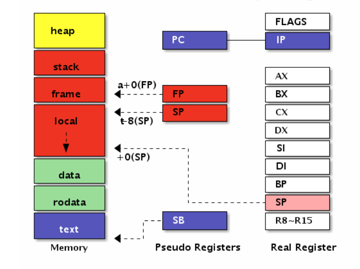

**编译过程**

go语言代码  =>  go汇编代码  =>  平台代码


**PC**

PC寄存器与IP寄存器是等价的，也就是说在 go汇编代码 => 平台代码 过程中，PC寄存器直接转换成IP寄存器。


**SB**

我们都知道，在linux下，虚拟内存被划分成 文本区，数据区(大概可以分为全局数据区，只读数据区，bss区)，栈区，堆区。**SB**寄存器在go汇编中就是用来**定义**和**读取** 文本区，数据区的。

**定义和读取数据区**

定义数据的格式:

```go
GlOBL symbol(SB), width
DATA symbol+offset(SB)/width, value
//pkg.s
//DATA ·Id+0(SB)/8, $18			填充Id的数据，offset=>第0个字节开始，width=>填充宽度8
//GLOBL ·Id(SB), $8				导出8个字节的变量Id，前面的·是格式，加上就好

//pkg.go
//var Id int                    声明Id为整形
```

offset 和 width也可以是别的值，操作的内存不要超出声明的8个字节就行了。

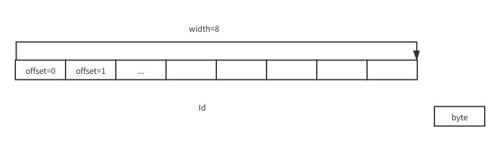

还可以给数据加上 NOPTR(非指针)，RODATA(只读) 等标志，但是这很麻烦，我们一般不用go汇编声明数据，直接用go语言(var Id = 18)就好了。

但是用汇编读取数据区的数据是经常要做的，读取数据格式：

```go
symbol+offset(SB)
//MOVQ    ·Id+0(SB), AX    从Id变量的第0个字节开始读取，MOVQ指令决定了读取宽度为8个字节
```

**定义和读取文本区**

文本区也叫做代码区，代码是可运行的数据。

定义文本区基本就是定义函数。

定义函数的格式，先记住格式，$framesize-argsize跟函数调用栈有关，搞清楚之后也很容易确定：

```go
TEXT symbol(SB), $framesize-argsize
//pkg.s
//TEXT ·ReadData(SB), $0-8          $0-8表示函数的帧为0字节，参数和返回值总大小为8字节
//    MOVQ    ·Id+0(SB), AX
//    MOVQ    AX, r0+0(FP)
//    RET
//
//pkg.go
//func ReadData() int  				声明函数
```

读取文本区就是调用函数，跳转到函数定义的地址。

```go
symbol(SB)
//  CALL  ·ReadData(SB)
```

上面只是说了定义函数和调用函数的格式，那原理是什么？这跟 FP，SP  寄存器相关。


**FP 和 SP 和 真SP 和 BP**

这是三个密切相关的寄存器，我们硬件也有一个栈顶寄存器SP，接下来把它叫做 **真SP**。

在C中，CALL指令会把当前IP压栈，RET指令相当于 POP  IP，然后在被调用函数内一般还会将BP寄存器压栈，用BP寄存器访问局部变量。如果不记得了，可以先复习一下C函数调用栈。

在go中，CALL指令会把当前PC压栈，RET指令相当于 POP  PC，BP寄存器会根据被调用函数的framsize是否大于0来确定是否压栈。

通过寄存器来引用一个值的格式，symbol只是一个助记符，没有其他意义，也不需要和传入的参数名字一样：

```go
symbol+offset(FP)
//arg1+8(FP)      表示FP的地址向前偏移8个字节的地址中的数据 
```

要注意的是，在go汇编中 offset(SP) 的SP表示真SP，symbol+offset(SP)的SP表示伪寄存器。


我们定义一个函数：

```go
//  想实现一个函数 func(a int, b int) int { return a*a + b*b }
//
//pkg.s
//TEXT ·Sum(SB), $0-24
//    MOVQ	a+8(SP), AX
//    IMULQ	AX, AX
//    MOVQ	b+16(SP), CX
//    IMULQ	CX, CX
//    ADDQ	CX, AX
//    MOVQ	AX, r1+24(SP)
//    RET
//
//pkg.go
//func Sum(a int, b int) int       
```

这个函数的 framsize 为 0， argsize 为 24。

假设调用 Sum(1, 2)，它的函数帧栈为：

.png)

因为 framsize 等于 0，所以 BP 寄存器不压栈，真SP和伪SP都指向返回地址，FP指向函数的第一个参数。

所以，我们可以通过三种方式 **arg1+0(FP), arg1+8(SP), 8(SP)**来获取第一个参数的值。

go的返回值也是通过栈传递的，在这里 **r1+16(FP), r1+24(SP), 24(SP)**都可以表示返回值。

再定义一个函数：

```go
//  想实现一个函数 func(a int, b int) int { return a*a + b*b }
//
//pkg.s
//TEXT ·Sum(SB), $16-24
//    MOVQ	a+0(FP), AX
//    IMULQ	AX, AX
//    MOVQ	b+8(FP), CX
//    IMULQ	CX, CX
//    ADDQ	CX, AX
//    MOVQ	AX, r1+16(FP)
//    RET
//
//pkg.go
//func Sum(a int, b int) int   
```

不同之处在于 framsize 为 16，通过 FP 来使用参数和设置返回值，函数帧栈为：

.png)

因为 framsize 大于 0 ，BP寄存器会压栈。同时 真SP 向下偏移framsize字节，预留空间。

go汇编 => 平台汇编 的过程中编译器会根据framsize会通过插入额外的压栈指令处理，手写汇编的时候不用自己判断，只需要知道寄存器指向哪里就好了。

为什么要预留空间呢？我们手写汇编时不应该使用PUSHQ，POPQ指令改变真SP的值，只能使用framsize规划好的内存，因为在运行这些指令时，我们没法知道协程栈会不会爆掉。如果提前规划好，调用前就可以比较栈够不够大。

而且，**FP，SP只是真SP的快捷键**，当真SP改变时，FP，SP也会改变。

在BP寄存器压栈时，它们的关系为：

```go
FP = 真SP + framsize + 16
SP = 真SP + framsize
```

那framsize怎么确定，其实framsize不需要十分精确，但是要保证足够用来调用函数，比如如果想调用一个声明为 func （int, int）int 的函数，那自己的framsize至少得为24吧，否则调用函数的空间都没有。如果要保存局部变量，那还得更大一点。总之，framsize不用十分精确，至少要够用，大一点也无所谓。

再用一个函数验证FP，SP，真SP之间的关系：

```go
//  func(int) (int, int, int)
TEXT ·Output(SB), $8-48
    //  通过FP获取
    MOVQ    arg1+0(FP), AX
    MOVQ    AX, ret1+8(FP)
    //  通过伪SP获取
    MOVQ    arg1+16(SP), BX // 当前framsize大小为8 > 0，所以 FP 在 SP 的上方 16 字节处
    MOVQ    BX, ret2+16(FP)
    //  通过真SP获取
    MOVQ    24(SP), DX
    MOVQ    DX, ret3+24(FP)
    RET
```

调用：

```go
a, b, c := Output(100)
println(a, b, c)            //  100 100 100
```


**混合类型**

func (a bool, b int16, c []int)

这种类型只要考虑清楚内存对齐，并不比全是 int 复杂多少，这个图很好地说明了问题：

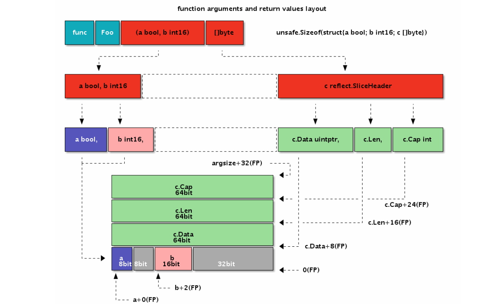


### nsq消息队列 ###

**构架**

nsq由 nsqd，nsqlookupd，nsqadmin组成。

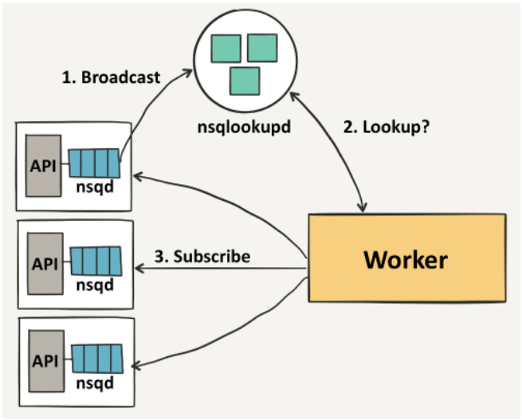

nsqd与nsqlookupd的关系，nsqlookupd其实充当的是一个注册中心的角色。

1. nsqd启动，到nsqlookupd注册自己的信息。nsqd运行中，自己的topic或者channel有变化，更新注册信息。

2. woker(也就是订阅者)首先确定自己想订阅哪个topic的哪个channel，然后到nsqlookupd查找符合条件的nsqd，之后会订阅所有满足条件的nsqd。woker在运行过程中，也可以每隔一段时间重新查询，看看有没有新的nsqd加入。

nsqadmin是一个web管理后台，还有一些nsqd运行的统计信息。

了解了基本的构架信息之后，显然，我们更关心的是nsqd


**nsqd通讯协议**

在[官网](<https://nsq.io/clients/tcp_protocol_spec.html>)可以看到，nsq设计了一套nsqd与发布者，订阅者之间的基于tcp的通讯协议。

协议非常简洁，在nsqd处理请求时，也是直接对应处理，我们重点关注对 **PUB, SUB, DPUB** 的处理。


**nsqd初始化和退出**

nsqd初始化时会读取配置，加载元信息(LoadMetadata)。元信息包括自己有哪些topics，以及topics有哪些channels。然后根据这些信息调用NewTopic，NewChannel恢复内存中的状态。那最重要的数据呢？数据保存在文件里，每一个Topic，Channel都对应一个文件，初始化阶段不会加载数据到内存。

nsqd退出时会持久化元信息(PersistMetadata)，将内存中的数据落盘。


**nsq处理请求**

protocolv2.Exec函数就是对每一个请求的处理。

```go
func (p *protocolV2) Exec(client *clientV2, params [][]byte) ([]byte, error) {
	if bytes.Equal(params[0], []byte("IDENTIFY")) {
		return p.IDENTIFY(client, params)
	}
	switch {
	case bytes.Equal(params[0], []byte("FIN")):
		return p.FIN(client, params)
	case bytes.Equal(params[0], []byte("RDY")):
		return p.RDY(client, params)
	case bytes.Equal(params[0], []byte("REQ")):
		return p.REQ(client, params)
	case bytes.Equal(params[0], []byte("PUB")):
		return p.PUB(client, params)
	case bytes.Equal(params[0], []byte("MPUB")):
		return p.MPUB(client, params)
	case bytes.Equal(params[0], []byte("DPUB")):
		return p.DPUB(client, params)
	case bytes.Equal(params[0], []byte("NOP")):
		return p.NOP(client, params)
	case bytes.Equal(params[0], []byte("TOUCH")):
		return p.TOUCH(client, params)
	case bytes.Equal(params[0], []byte("SUB")):
		return p.SUB(client, params)
	case bytes.Equal(params[0], []byte("CLS")):
		return p.CLS(client, params)
	case bytes.Equal(params[0], []byte("AUTH")):
		return p.AUTH(client, params)
	}
	return nil, protocol.NewFatalClientErr(nil, "E_INVALID", fmt.Sprintf("invalid command %s", params[0]))
}
```


**PUB**

现在假设我们要像topic(topicName=tp1)发布一个msg(msg=hello)。

对于nsqd，第一步当然是先找到这个topic：

```go
t, ok = n.topicMap[topicName]
```

找不到，怎么办？创建：

```go
t = NewTopic(topicName, &context{n}, deleteCallback)
n.topicMap[topicName] = t
```

怎么创建的？首先我们选择用chan把信息存储在内存：

```go
t.memoryMsgChan = make(chan *Message, ctx.nsqd.getOpts().MemQueueSize)
```

如果信息的数量大于MemQueueSize，就把数据存储在文件中：

```go
t.backend = diskqueue.New(topicName, ......)
```

这个diskqueue是啥？它把文件抽象成了chan，有一个协程会不断的阻塞在readChan和writeChan上处理读写文件的请求：

```go
// ReadChan returns the receive-only []byte channel for reading data
func (d *diskQueue) ReadChan() <-chan []byte {
	return d.readChan
}
// Put writes a []byte to the queue
func (d *diskQueue) Put(data []byte) error {
	d.writeChan <- data
	return <-d.writeResponseChan
}
```

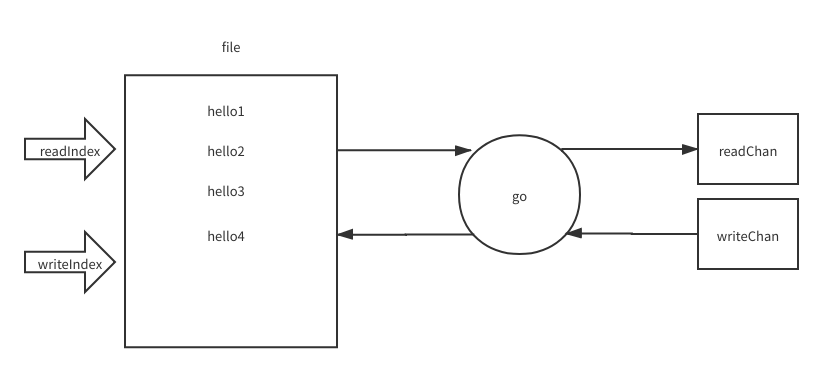

如果把memMsgChan和disqueue组合起来，那就相当于有了一个能存储大量数据的chan了，我们就把它叫做MemDisChan：

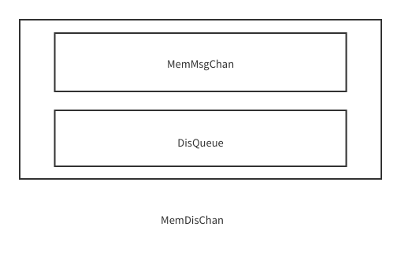

我们创建的topic，就相当于一个MemDisChan。

接下来就把msg储存到topic，我们优先储存到MemMsgChan：

```go
select {
	case t.memoryMsgChan <- msg:
	default:
		err := writeMessageToBackend(msg, t.backend)
	}
```

从这里可以看出一个有disqueue的**topic是无顺序的，**而且**MemMsgChan的数据可能丢失**。


**SUB**

现在假设我们要在channel(channelName=c1)订阅刚才的tp1。

不同的订阅者是可以竞争同一个channel的，topic和channel的关系为：

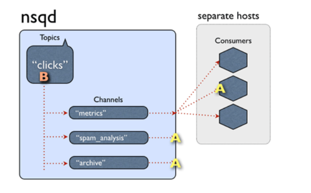

首先也看看tp1存不存在这个channel，没有就创建：

```go
channel, ok := t.channelMap[channelName]
if !ok {
		channel = NewChannel(t.name, channelName, t.ctx, deleteCallback)
		t.channelMap[channelName] = channel
	}
```

channel又是怎么创建的呢？与topic是相似的，channel其实也是一个MemDisChan！

```go
c.memoryMsgChan = make(chan *Message, ctx.nsqd.getOpts().MemQueueSize)
t.backend = diskqueue.New(topicName, ......)
```

现在我们就可以给出topic和channel的存储关系了，tp1，c1，c2，c3都是MemDisChan：

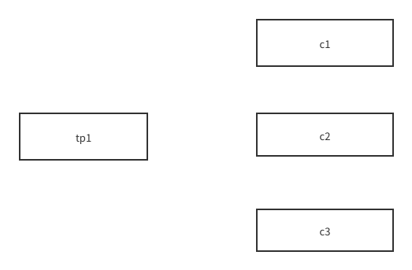

那topic的数据怎么向它的channels流动，原来每一个topic创建的时候会开启一个信息泵(messagePump)协程，它会不断地从tp1读取数据并写到c1，c2，c3中，比如现在tp1有一个数据hello：

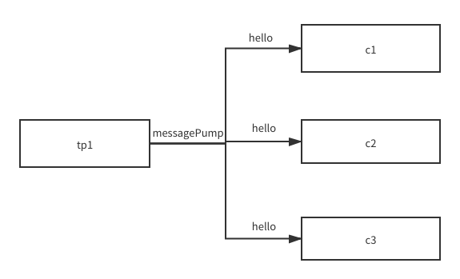

当然这里**传递的只是消息的元数据，不用担心数据在内存中不断地复制**。

这样消息就由topic推到了channels，那channels又是怎样把消息推到订阅者的？原来，每一个订阅者也会有一个信息泵(messagePump)协程，根据订阅者的状态，从订阅的channel中读取消息。

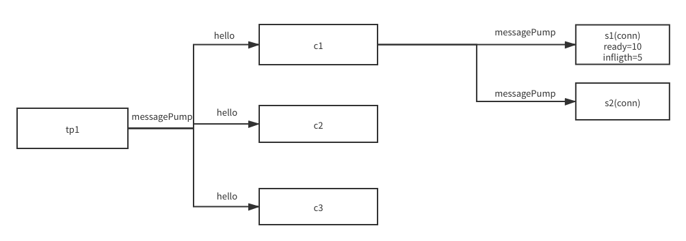

注意与topic的不同，每一个订阅者都有一个messagePump，不同的订阅者之间是竞争关系。

状态ready表示这个订阅者可以同时处理的消息数，订阅者可以发送RDY请求改变。状态inflight表示这个订阅者正在消费的消息数，messagePump会保证 inflight <= ready。

```go
subChannel.StartInFlightTimeout(msg, client.ID, msgTimeout)
client.SendingMessage()
err = p.SendMessage(client, msg)
```

inflight状态的消息需要订阅者发送FIN表示消费完成，如果订阅者在msgTimeout之后仍然没有发送FIN，则认为消息处理失败，该消息重新加入对应的channel。

这听起来需要一个定时器，超时时间为msgTimeout。nsq没有选择使用标准库的timer包，选择了自己用堆实现的优先队列，每一个channel都有对应一个队列。

```go
msg.pri = now.Add(timeout).UnixNano()  //消息在队列中的优先级
```

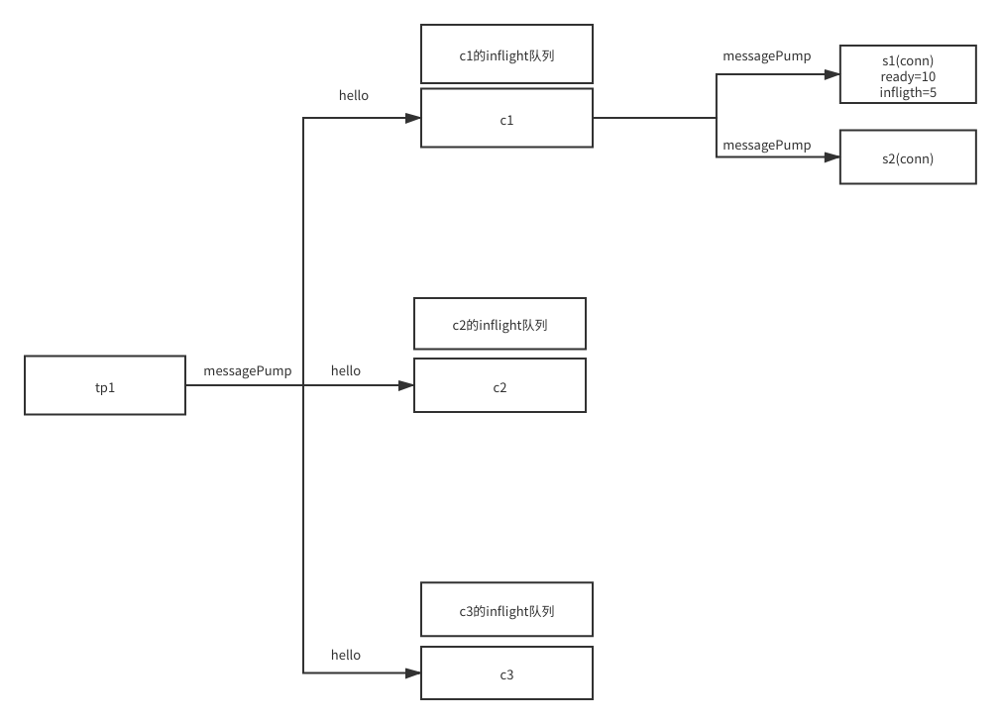

那谁处理到期的信息？nsq启动时会开启queueScanLoop协程，这个协程又会控制一些queueScanWorker协程去检查所有inflight队列，如果到期了就将消息重新放回对应的channel(收到FIN的消息会从队列中删除)。

如果这时候nsq退出，inflight的消息会落盘，当失败处理。

这样，我们就**保证了消息至少消费一次**。


**DPUB**

DPUB请求是延迟发布，比如发布者可以设置延迟时间为10s，那么10s之后消息才会进入channel被消费。这个逻辑是不是跟处理inflight的消息很像。nsq的处理方式也是跟inflight相似！用的也是堆实现的优先队列，由queueScanWorker协程一并处理！

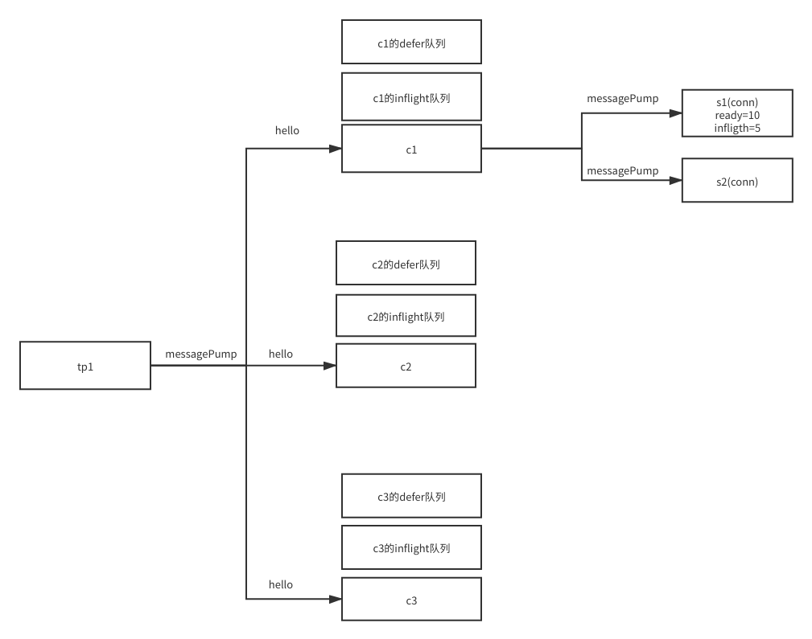

messagePump的根据消息的类型判断要不要放入延迟队列。

```go
if chanMsg.deferred != 0 {
				channel.PutMessageDeferred(chanMsg, chanMsg.deferred)
				continue
}
```

queueScanWorker协程会同时检查channel的inflight队列和defer队列：

```go
for {
		select {
		case c := <-workCh:					  //  c是channel，worker其实相当于协程池里的协程
			now := time.Now().UnixNano()
			dirty := false
			if c.processInFlightQueue(now) {  //  处理inflight队列，并且返回是否有消息到期
				dirty = true
			}
			if c.processDeferredQueue(now) {  //  处理defer队列，并且返回是否有消息到期
				dirty = true
			}
			responseCh <- dirty
		case <-closeCh:
			return
		}
	}
```

需要注意的是，如果nsq关闭，消息会落盘，但是消息的延迟时间会丢失，也就是说，**延迟信息会在重启时马上被消费!**

github上提到的解决方法是，由消费端根据消息的创建时间判断消息是否被提前消费。如果提前消费，发起REQ请求并带上延迟时间，将消息重新放入defer队列。


**需要注意的点总结**

1.消息无顺序

2.至少消费一次

3.重启后defer消息会马上加入消费队列

4.异常关闭，可能会丢失memMsgChan，inflight队列，defer队列的消息

5.数据只有一份没有复制

6.名字以"#ephemeral"结尾的topic或channel不会落盘


### 总结 ###

nsqd非常精简，也算是学习了一个正儿八经的队列。
