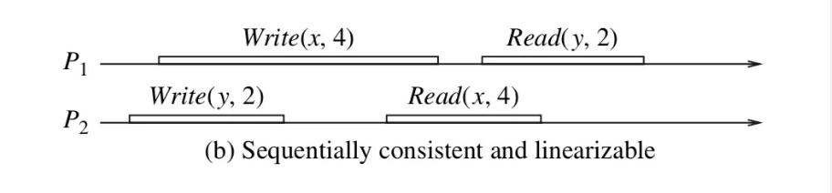
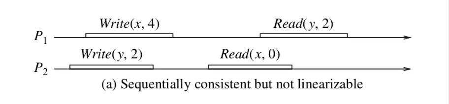
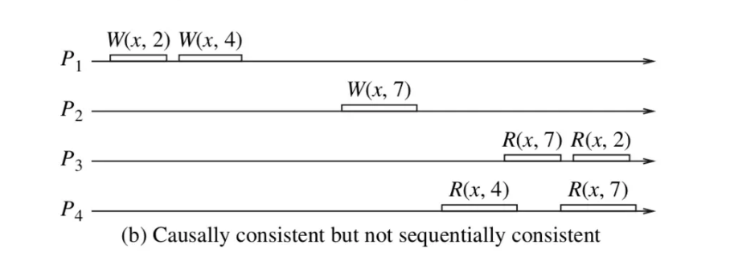

# 2019.12读书笔记

《go语言并发之道》和 《数据密集型应用》的读书笔记。


## 1. go语言并发之道

#### 第一章

用了3个示例分别描述 *死锁*，*活锁*，*饥饿*。

凡是用到的锁多于2个，死锁都是要考虑的问题。

活锁在实际开发中还没有碰到过。

我对饥饿的理解，饥饿是锁的设计问题，不是程序员怎么用锁的问题，go的锁实现是有考虑饥饿状态的。我觉得书中饥饿的示例不恰当，greedy 协程的 count 为 20，polite 协程的 count 为 10，greedy 获取了 20 次锁，polite 获取了 10 * 3 = 30 次锁，怎么能说 polite 处于饥饿？


#### 第二章

转让数据所有权用 channel 。

多个逻辑片段用 channel (select && case) 。

维护结构体内部状态用 mutex 。

性能要求高用 mutex 。

纯 csp 肯定是不现实的，我们是工程师，应该做一个实用主义者，实用简洁是 go 最吸引人的地方。


#### 第三章

讲了 go 里面的各种并发模型，还讲了临时对象池 sync.Pool ，没有讲原子操作。

只要有了 3 种能力：1. 原子操作（cpu指令提供）2.协程阻塞（runtime提供）3.协程唤醒（runtime提供），我们就能实现各种各样的并发模型！


#### 第四章

for-select循环，防止goroutine泄露(done channel)，错误处理(wrap一层向外传递)，context，pipeline 比较常见。

or-channel(用递归给多个channel加上或逻辑)，tee-channel(将一个channel的输出复制到多个channel)，桥接channel(chan chan int)，队列排队(用一个缓冲channel解耦) 有待实践。

扇出的关键是stage中的任务可以轻易的分解，如果这个stage是排序那就没有这么简单了。


#### 第五章

常见并发模式的简单使用。

复制请求，通过任务冗余提高响应速度，代价就是昂贵的资源。

速率限制，通过x/time/rate库(我猜实现方式是有个协程按给定的速率增加一个同步量)实现限速。


#### 第六章

正在执行的线程从队列的尾部进栈出栈任务，其他线程从队列头部窃取续体，因为尾部的任务更有可能完成join，也是最有可能在cpu缓存中的。

测试协程调度顺序，得出了不同的结论，测试代码1：

``` go
//  go v1.13
package main
import (
	"runtime"
	"time"
)
func main() {
	runtime.GOMAXPROCS(1)
	for i := 0; i < 10; i++ {
		go func(a int) {
			println(a)
		}(i)
	}
	time.Sleep(10*time.Second)
}
```

输出：

```go
0
1
2
...  //  按顺序
8
9
```

新创建的协程加到队尾，从队头开始执行。

测试代码2：

```go
//  go v1.13
package main
import (
	"runtime"
	"time"
)
func main() {
	runtime.GOMAXPROCS(1)
	for i := 0; i < 10; i++ {
		go func(a int) {
			time.Sleep(3*time.Second)  //  阻塞调用
			println(a)
		}(i)
	}
	time.Sleep(10*time.Second)
}
```

输出

```go
9
0
1
...  //  按顺序
7
8
```

被阻塞的协程加到队头，并将当前队头的协程踢到队尾，从队头开始执行。


## 2.数据密集型应用

### 第一部分

讲了一些基础，关系模型，sql，b树索引，json编码，xml编码，protobuf编码。


### 第二部分

#### 第五章

**复制好处**

1.提高可用性，主节点出故障了其他的节点可以继续工作 

2.提高并发读取的吞吐量，所有节点都可以处理读。


##### 主库数量

最常用的变更复制方式是单主复制。

复制可以是同步的也可以是异步的，同步复制的系统是强一致性的，异步复制的系统只能满足最终一致性(最终一致性是一种很弱的保证！)。

当变更复制方式使用多主复制或无主复制时，合并需要解决冲突，常用的解决冲突的方法为最新写胜出或合并。


##### 怎么复制

基于语句复制会导致一些函数的值不一致。

wal包含哪些磁盘块中哪些字节有变化，与存储引擎的实现高度相关。

逻辑日志记录了表中某一行的值的变更，不关心是怎么存储的，就选你了！


#### 第六章

数据分区的方式：

1. 按 id 进行 range 分区

   优点：高效的范围查询

   缺点：规律行太强，容易导致某些分区过热。比如资讯网站，比较新的资讯是热点数据，它们的id会比较集中，因为都是最近生成的。

2. 按 id 一致性 hash 分区

   优点：有效消除热点

   缺点：数据随机地分配到各个分区，无法进行高效的范围查询

   

**一致性哈希**将槽数与节点数分离，再将槽分配给不同的节点管理，有效实现了节点的动态伸缩，虚拟节点只是槽的不同分配方式！

分区给次级索引带来了问题，如果有 4 个分区，我们想查询一个次级索引就必须在 4 个分区中分别查一次次级索引，解决方法就是维护一个全局的次级索引，再将全局次级索引按关键词存储到各个分区。


#### 第七章

主要讲了单体数据存储系统的事务隔离级别。


#### 第八章

分布式系统中面临的挑战，网络延迟，网络瘫痪，尽量一致的全局时钟，节点GC，节点暂停，节点故障。


#### 第九章

##### 分布式存储系统的一致性


*线性一致性(强一致性)*

- 系统中所有的进程，看到的操作顺序都和上帝视角下看到的顺序一致



Write(x, 4) 表示赋值操作 x = 4，Read(x, 4)表示读到x的值为 4，下同。

线性一致性下可以把存储系统看成单副本的，单主同步复制的系统是线性一致的，etcd实际上是一种单主懒同步复制系统，也是线性一致的！


*顺序一致性*

- 系统中的所有进程，看到的操作顺序能达成一致(不要求与上帝视角一致)



在上帝视角中，P2 的 Read(x, 0) 肯定是不满足线性一致性的。那它为什么满足顺序一致性呢，我们可以把 P2 的 Write(y, 2) ，Read(x, 0) 看成滑块，将它们滑到 P1 的 Write(x, 4)的左边。这样得到了一个新的顺序：

P1 _______________________________________________________________________________________________________________________________Write(x, 4)_____________________________Read(y, 2)______________________________________

P2 _________________________Write(y, 2)_____________Read(x, 0)________________________________________________________________________________________________________________________________________________________

这个顺序就是所有进程统一认为的顺序，虽然和上帝视角的顺序不一致。

通俗地说，如果我们能通过滑动滑块(同一个进程的滑块不能交换顺序)来获得一个统一的顺序，我们就说这个系统是顺序一致的。

所有线性一致的系统一定是顺序一致的！

怎么构造一个只保证顺序一致的系统？这样的系统有什么价值？


*因果一致性*

- 每一个进程可以忽略其他只读的进程，并在本进程内看到一个合理的顺序(不要求所有进程看到的顺序呢达成一致)



忽略 P3 或 P4，我们通过滑动滑块可以分别得到一个合理的顺序，这是满足因果一致性的。

但是我们没有办法得到一个所有进程统一的顺序，所以这个系统不是顺序一致的。

顺序一致的系统一定是因果一致的！

怎么构造一个只保证因果一致的系统？这样的系统有什么价值？


*读写一致性*

- 不考虑并发的情况下，自己读的值应该就是自己上一次写的值

这听起来可能是一句废话，但是我们最常用的单主异步复制连这个一致性都不能保证，这是因为读请求可能路由到了一个落后的从库。可以改造一下，让写请求的进程在一段时间内必须从主库读取来满足读写一致性。


*单调读一致性*

- 读取的值必须是越来越新的

单主异步复制系统也不能做出单调读的保证，可以让读请求带上上一次读的时间戳，然后把请求路由到一个至少比这个时间戳新的从库满足单调读一致性。


*最终一致性*

- 如果停止写入，各个副本的数据会收敛到一致的状态。

最终一致性是一种非常弱的保证，单主异步复制就是一个满足最终一致性的例子。


##### 共识问题(比如选主)

**raft算法**

raft算法是超时驱动的！

如果我是**follower**，我要做的事情就是：

1. 等待大哥给我发来心跳
2. 同步大哥发来的日志
3. 如果大哥很久没给我发心跳了，那我认为他跪了，我要竞选！

如果我是**candidate**，我要做的事情就是：

1. 请求其他所有节点选我当大哥
2. 如果同意选我为大哥的节点少于一半，那我就等等看有没有其他节点成为了大哥给我发心跳，如果有就认他为大哥，如果过一段时间还没有我就发起下一轮竞选(所有节点获得的票都少于一半是有可能的)。
3. 如果同意选我为大哥的节点超过一半，那我就当大哥！

如果我是**leader**(大哥)，我要做的事情就是：

1. 每隔一段时间给小弟发心跳，不要让他们造反
2. 有写请求到来，先把日志同步给小弟，如果超过一半的小弟说可以提交就广播提交返回成功，否则返回失败。

有时间还是要看一下raft的论文！


### 第三部分

简单介绍了 mapreduce，broker 。


参考资料：

[1.GO 互斥锁实现原理剖析](<https://my.oschina.net/renhc/blog/2876211>)

[2.分布式事务中的一致性你真的懂吗？](<https://juejin.im/post/5be990d96fb9a049ed3064ba>)

[3.ETCD背后的Raft一致性算法原理](<https://www.jianshu.com/p/5aed73b288f7>)


### 总结

第一次读这两本书，抓住了主干，在实践中才能有深刻的体会！